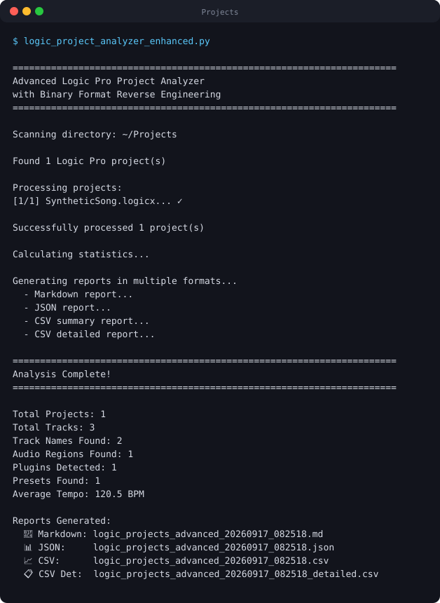

# LogicX Analyzer

<!-- BADGES:START -->

[](LICENSE.md)
[](CONTRIBUTING.md)
<!-- BADGES:END -->

## Table of Contents

- [Description](#description)
- [Screenshots](#screenshots)
- [Features](#features)
- [Requirements](#requirements)
- [Installation](#installation)
- [Usage](#usage)
  - [Analysing a folder of projects](#analysing-a-folder-of-projects)
  - [Other analyzers](#other-analyzers)
  - [Binary research tools](#binary-research-tools)
  - [Example output](#example-output)
  - [Use cases](#use-cases)
- [Version History](#version-history)
- [Architecture](#architecture)
  - [Inside a .logicx bundle](#inside-a-logicx-bundle)
  - [The ProjectData format](#the-projectdata-format)
  - [What has been decoded](#what-has-been-decoded)
  - [Project layout](#project-layout)
  - [Documentation](#documentation)
- [Credits](#credits)
- [Contributing](#contributing)
- [License](#license)
  - [Disclaimer](#disclaimer)

## Description

A set of Python scripts for looking inside Logic Pro projects. Point the main
analyzer at a folder of `.logicx` bundles and it writes a report on every
project: tempo, key and time signature, the plugins and Session Players presets
it uses, its tracks and regions, and how its binary data is laid out.

Logic's `ProjectData` file is an undocumented binary format. Most of this
project is the work of decoding it, and the lower-level tools here are for
continuing that research. About 60% of the format is understood so far; custom
track names are the main open problem.

The scripts use only the Python standard library.

## Screenshots

<p align="center">
  
</p>

<p align="center"><em>The analyzer's entry point, captured from a real run.</em></p>

## Features

**From `MetaData.plist`**

- Tempo, key and time signature
- Track count and sample rate
- The audio files a project uses
- The Logic Pro version that saved it

**From the binary `ProjectData`**

- **Plugins used**, such as Alchemy, Sampler and Retro Synth
- **Session Players presets** with every parameter: preset names ("Sweet
  Memories", "Night Flight"), character types (Electric Bass, Acoustic Piano,
  Drummer) and settings such as intensity, dynamics, humanise and variation
- **Structure**: how many track, MIDI, audio-region and other chunks a project
  has, as a measure of its complexity
- **Alchemy library references**: oscillators, LFOs and formants
- **Track and region names**; generic track names such as "Audio 1" are found,
  custom ones only partly
- **Tempo candidates** found in the binary data

**Reports** as Markdown, JSON and CSV, covering every project in a folder with
summary statistics across them.

## Requirements

- **Python 3.9** or newer. There are no third-party dependencies.
- **Logic Pro projects** (`.logicx` bundles) to analyse. The tools were
  developed on macOS Sonoma 14 with projects saved by Logic Pro 10 and 11.
- The scripts only read files, so they run on any operating system that can see
  the bundles. Close a project in Logic before analysing it.

## Installation

```bash
git clone https://github.com/geoffmyers/logicx-analyzer.git
```

There is nothing to install. Run the scripts with `python3`.

## Usage

### Analysing a folder of projects

Run the enhanced analyzer **from the folder that holds your projects**. It reads
every `.logicx` bundle directly inside that folder.

```bash
cd ~/Music/Logic
python3 /path/to/logicx-analyzer/scripts/logic_project_analyzer_enhanced.py
```

It writes four files into the same folder, named with the date and time:

| File | Contents |
|---|---|
| `logic_projects_advanced_<timestamp>.md` | The full report: musical attributes, binary structure, plugins and presets, Session Players, tracks and regions, audio resources, Alchemy references |
| `logic_projects_advanced_<timestamp>.json` | The same data, for other tools |
| `logic_projects_advanced_<timestamp>.csv` | One row per project |
| `logic_projects_advanced_<timestamp>_detailed.csv` | A more detailed table |

Back up your projects before analysing them. The tools never write to a bundle,
but the format is undocumented.

### Other analyzers

Both run from the folder that holds your projects, like the enhanced analyzer.

| Script | What it does | Writes |
|---|---|---|
| `scripts/logic_project_analyzer.py` | The original analyzer: `MetaData.plist` only, fast | `logic_projects_report_<timestamp>.md` and `.csv` |
| `scripts/extract_track_names.py` | Track names from each project's `ProjectData` | `track_names_report.md` |

### Binary research tools

These take the path to one project's `ProjectData` file. Without an argument,
they use the first `ProjectData` they find below the current folder.

```bash
python3 scripts/binary_format_analyzer.py "My Song.logicx/Alternatives/000/ProjectData"
```

| Script | What it does | Writes |
|---|---|---|
| `binary_format_analyzer.py` | Finds chunk markers (`karT`, `gRuA`, `qeSM`, …), extracts strings several ways, and looks for numeric patterns | `binary_analysis_<project>.txt` |
| `chunk_structure_analyzer.py` | Maps and counts every chunk, and lists track-name candidates | `chunk_structure_<project>.txt` |
| `extract_plugin_data.py` | Extracts embedded JSON presets, plugin names and audio file paths | `plugin_data_<project>.txt` and `.json` |
| `hex_dump_analyzer.py` | Annotated hex dumps around each marker type | `hex_analysis_<marker>_<project>.txt` |

All output is written to the current folder. `scripts/experimental/` holds
earlier research scripts that are kept for reference and not meant for use; see
its README.

### Example output

Summary statistics from a real library of 39 projects:

```
Total Projects: 39
Total Tracks: 588
Track Names Extracted: 394
Audio Regions Extracted: 1,066
Plugins Detected: 604
Presets Found: 642
Average Tempo: 99.74 BPM
```

Plugin usage:

```
| Plugin              | Projects |
|--------------------|----------|
| Sampler            | 11       |
| Q-Sampler          | 10       |
| Retro Synth        | 9        |
| Alchemy            | 7        |
```

Session Players characters:

```
| Character                        | Usage |
|----------------------------------|-------|
| Electric Bass - Modern R&B       | 183   |
| Acoustic Piano - Strummed        | 120   |
| Keyboard - Supporting Pad        | 66    |
| Acoustic Drummer - Neo Soul      | 63    |
```

One project in detail:

```
### Example Project

**Musical Attributes:**
- Tempo: 120.0 BPM
- Key: C minor
- Time Signature: 4/4
- Tracks: 15

**Binary Structure:**
- Total Chunks: 801
- Track: 320
- MIDISequence: 169
- EventSequence: 169
- AudioRegion: 38

**Session Players Presets:**
*Electric Bass - Modern R&B:*
- **Steady Rolling** (Type_ElectricBassV2)
  - intensity: 79, dynamics: 100, riffiness: 3
```

A typical 2–3 MB project takes a second or two to analyse.

### Use cases

- **Musicians and producers**: see which plugins and Session Players presets you
  actually use, find patterns in your keys and tempos, and keep an inventory of
  your projects.
- **Researchers and tool builders**: study the `ProjectData` format and build on
  what has been decoded.
- **Archiving**: record each project's settings and the audio it depends on.

## Version History

**2.0 (December 2025).** Binary format parsing, plugin detection, Session
Players preset extraction, structure mapping, Alchemy references, tempo from
binary data, and six new report sections.

**1.0 (November 2025).** Metadata extraction, partial track names, audio
resource counts, musical attributes and CSV export.

## Architecture

### Inside a .logicx bundle

```
Project.logicx/
├── Alternatives/000/
│   ├── MetaData.plist           # tempo, key, time signature (read by every analyzer)
│   └── ProjectData              # the binary project (read by the binary tools)
├── Resources/
│   └── ProjectInformation.plist # the Logic version
└── Media/                       # audio files
```

### The ProjectData format

- A **chunk-based** file, similar in spirit to IFF and RIFF, starting with the
  bytes `23 47 c0 ab`
- Chunks marked by **reversed four-character codes**: `karT` is "Trak" backwards
- **Mostly big-endian** numbers, with some exceptions
- **Four string encodings** side by side: one-, two- and four-byte length
  prefixes, and null-terminated
- **Embedded JSON** for Session Players presets

| Marker | Meaning | Typical count |
|---|---|---|
| `karT` | Track | ~320 |
| `qeSM` | MIDI sequence | ~169 |
| `qSvE` | Event sequence (automation) | ~169 |
| `gRuA` | Audio region | ~38 |
| `tSxT` | Text and notation style | ~32 |
| `LFUA` / `lFuA` | Audio file reference | ~23 |
| `PMOC` | Comping and takes | ~23 |
| `tSnI` | Instrument | ~1 |

The analysis runs in stages: read `MetaData.plist`, map the chunks in
`ProjectData`, extract strings for track and region names, parse the embedded
JSON presets, identify plugins, then write the reports.

### What has been decoded

| Status | Areas |
|---|---|
| **Decoded** | The chunk structure, plugin names, Session Players presets and parameters, 32 notation text styles, Alchemy library references, audio file references, structure metrics, tempo candidates |
| **Partly decoded** | Track names (generic names only), MIDI sequence structure, automation structure |
| **Not yet decoded** | Custom track names, MIDI note data, automation curves, third-party plugin state, mixer channel strips, Smart Controls, Flex Time and Flex Pitch |

### Project layout

```
logicx-analyzer/
├── scripts/
│   ├── logic_project_analyzer_enhanced.py   # the main analyzer
│   ├── logic_project_analyzer.py            # metadata-only analyzer
│   ├── extract_track_names.py
│   ├── binary_format_analyzer.py
│   ├── chunk_structure_analyzer.py
│   ├── extract_plugin_data.py
│   ├── hex_dump_analyzer.py
│   └── experimental/                        # archived research scripts
└── docs/                                    # format research and guides
```

### Documentation

| Document | What it covers |
|---|---|
| [docs/README_BINARY_ANALYSIS.md](docs/README_BINARY_ANALYSIS.md) | A guide to the binary analysis tools and what they extract |
| [docs/RESEARCH_SUMMARY.md](docs/RESEARCH_SUMMARY.md) | The reverse-engineering findings and the next research steps |
| [docs/BINARY_FORMAT_FINDINGS.md](docs/BINARY_FORMAT_FINDINGS.md) | The format specification: markers, encodings, numeric types, plugin data |
| [docs/QUICK_REFERENCE.md](docs/QUICK_REFERENCE.md) | Commands at a glance |
| [docs/MULTI_FORMAT_OUTPUT.md](docs/MULTI_FORMAT_OUTPUT.md) | Examples of the Markdown, JSON and CSV reports |

See [ARCHITECTURE.md](ARCHITECTURE.md) for more detail.

## Credits

Built with the Python standard library alone.

Logic Pro is a trademark of Apple Inc. This project reads project files produced
by Logic Pro and is not affiliated with or endorsed by Apple.

Written by Geoff Myers.

## Contributing

Research contributions are especially welcome. If you decode a new chunk type or
data structure:

1. Document what you found in Markdown.
2. Add test cases to the analyzers.
3. Update [docs/RESEARCH_SUMMARY.md](docs/RESEARCH_SUMMARY.md).
4. Open a pull request.

Custom track names are the top research priority. See
[CONTRIBUTING.md](CONTRIBUTING.md) for the full guidelines and the list of open
research questions.

## License

Copyright © 2026 Geoff Myers

This program is free software: you can redistribute it and/or modify it under
the terms of the GNU General Public License as published by the Free Software
Foundation, either version 3 of the License, or (at your option) any later
version.

This program is distributed in the hope that it will be useful, but WITHOUT ANY
WARRANTY; without even the implied warranty of MERCHANTABILITY or FITNESS FOR A
PARTICULAR PURPOSE. See [LICENSE.md](LICENSE.md) for the full text of the GNU
General Public License.

SPDX-License-Identifier: `GPL-3.0-or-later`

### Disclaimer

The Logic Pro project format is proprietary to Apple Inc. This project studies
it for interoperability and archival purposes, to let people read and document
their own projects. The tools are provided as-is, without warranty, as the
licence states; back up your projects before analysing them.
